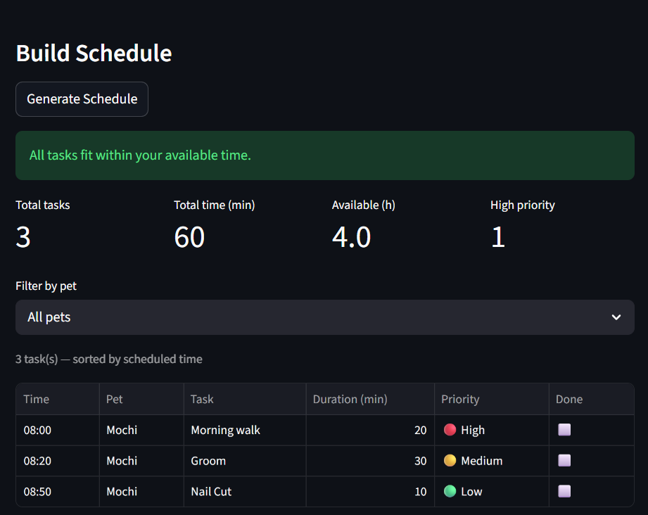

# PawPal+ (Module 2 Project)

You are building **PawPal+**, a Streamlit app that helps a pet owner plan care tasks for their pet.

## Scenario

A busy pet owner needs help staying consistent with pet care. They want an assistant that can:

- Track pet care tasks (walks, feeding, meds, enrichment, grooming, etc.)
- Consider constraints (time available, priority, owner preferences)
- Produce a daily plan and explain why it chose that plan

Your job is to design the system first (UML), then implement the logic in Python, then connect it to the Streamlit UI.

## What you will build

Your final app should:

- Let a user enter basic owner + pet info
- Let a user add/edit tasks (duration + priority at minimum)
- Generate a daily schedule/plan based on constraints and priorities
- Display the plan clearly (and ideally explain the reasoning)
- Include tests for the most important scheduling behaviors

## Getting started

### Setup

```bash
python -m venv .venv
source .venv/bin/activate  # Windows: .venv\Scripts\activate
pip install -r requirements.txt
```

### Suggested workflow

1. Read the scenario carefully and identify requirements and edge cases.
2. Draft a UML diagram (classes, attributes, methods, relationships).
3. Convert UML into Python class stubs (no logic yet).
4. Implement scheduling logic in small increments.
5. Add tests to verify key behaviors.
6. Connect your logic to the Streamlit UI in `app.py`.
7. Refine UML so it matches what you actually built.

## 📸 Demo
<a href="Project_2_Demo.png" target="_blank"></a>

## Smarter Scheduling

The three main features are the Owner, Pet, Task, and Schedule Classes and the Functions included in it. The Owner class is the most important class in the program by how it is the one where it stores the information/data where the class Schedule and Pet get their data from, in which Tasks get data from Pet. The featured functions are functions that make the readibility and performance easy.

## Testing PawPal+

python -m pytest
During the testing parts, it basically covered the three suite mentioned in Phase 5 Step 2, Sorting Correctness where it ensures that the teasks are returned in chronological order, Recurrence logic to confirm that completing a daily creates new task, and finnaly Conflict Detection to ensure the my Schedule class flags a conflict of duplicate datas. The reason for this because I interpreted the test functions as the testing and verifying of the core behaviors. Unless I'm wrong. I would say about 4 starts because even if it says that all passed, I know that there are some things that may cause another error and such.

## Features

- **Priority-Based Scheduling** — `generateSchedule()` sorts all tasks high → medium → low priority, then by shortest duration within each tier, so critical care always appears first.
- **Sort by Time** — `sort_by_time()` returns the schedule in chronological order (earliest `HH:MM` first); the UI uses this to display tasks in a time-ordered table.
- **Conflict Detection** — `getConflicts()` uses `itertools.combinations` to find every pair of tasks sharing the same time slot; `hasConflicts()` and `addTask()` surface warnings in the UI when overlaps exist.
- **Daily & Weekly Recurrence** — completing a recurring task via `markCompleted()` automatically spawns a new incomplete copy due the next day (`timedelta(days=1)`) or next week (`timedelta(weeks=1)`).
- **Availability Check** — `canFitSchedule()` compares total scheduled minutes against the owner's available hours and displays a pass/fail banner.
- **Per-Pet Filtering** — `filterTasks(pet_name=...)` lets the owner view only tasks belonging to a specific pet without rebuilding the schedule.
- **Multi-Pet Support** — `Owner.getAllTasks()` aggregates tasks across every pet, and the schedule treats them as one unified pool for sorting and conflict checking.
